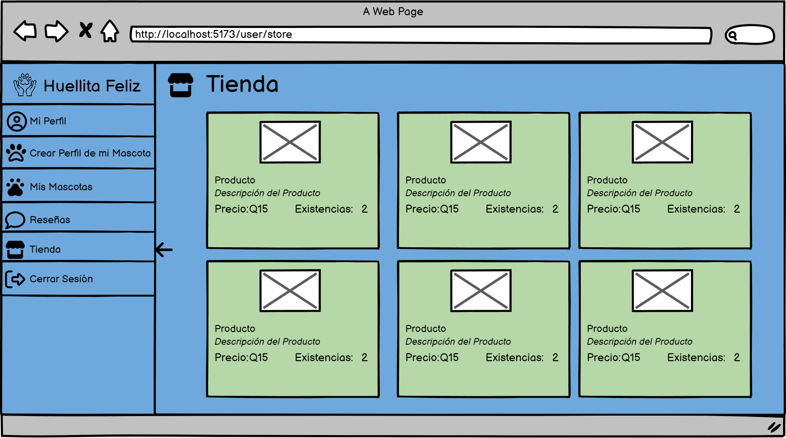
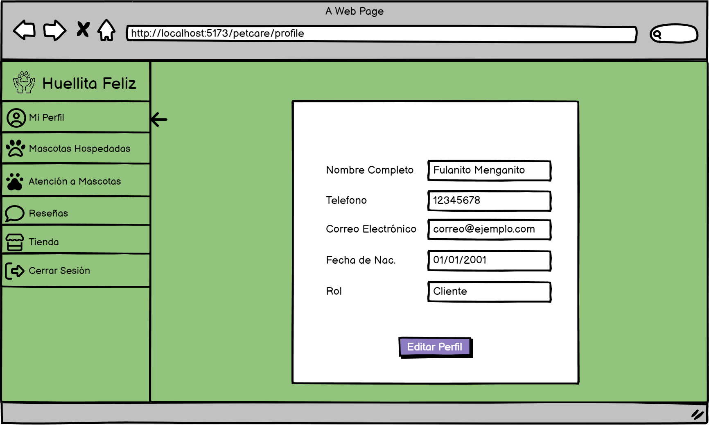
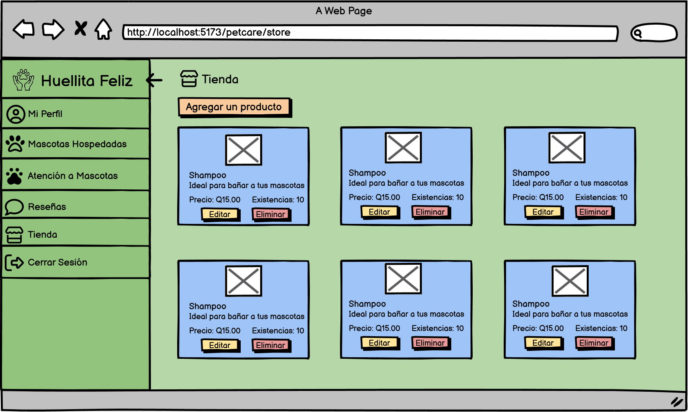

# Documentación Proyecto 2 Grupo 2

# 🐶 Huellita Feliz

## 📝 ÍNDICE
- [Mock-ups](#mockups) 
- [Modelo entidad relación](#modelo-entidad-relación)
- [Diagrama de caso de uso](#diagrama-de-caso-de-uso)
- [Diagrama de caso de uso de alto nivel](#diagrama-de-caso-de-uso-de-alto-nivel)
- [Diagrama de caso de uso expandido](#diagrama-de-caso-de-uso-expandido)

## Mock-ups
### Inicio de sesión

### Registro de usuario

### Interfaz Cliente

- #### Perfil

- #### Editar Perfil

- #### Crear Perfil de Mascota

- #### Mis Mascotas

- #### Hospedar Mascota

- #### Reseñas

- #### Tienda

### Interfaz Cuidador

- #### Perfil

- #### Editar Perfil

- #### Mascotas Hospedadas

- #### Atención a Mascotas

- #### Reseñas

- #### Tienda

- #### Agregar Producto a Tienda

## Modelo entidad relación

## Diagrama de caso de uso

## Diagramas de caso de uso de alto nivel

## Diagramas de caso de uso expandido